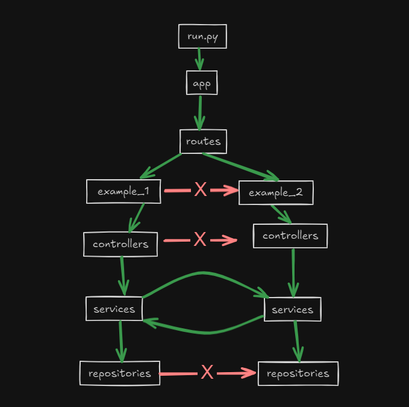

# My Flask App

This project is a web application developed with Flask that follows a modular and organized structure to facilitate scalability and maintenance.

## Project Structure

The project follows an organized structure into modules, allowing for easy maintenance and expansion. Below is a description of each directory:

``` bash
my_flask_app/
├── app/ # Main application directory
│   ├── db/ # Directory for database configuration and management
│   ├── models/ # Directory for storing database models (if using an ORM)
│   ├── modules/ # Directory to organize different modules of the application
│   │   ├── example_1/ # Example module 1
│   │   │   ├── controllers/ # Controllers for module 1 (handle HTTP requests)
│   │   │   ├── services/ # Services for module 1 (business logic)
│   │   │   └── repositories/ # Repositories for module 1 (interact with external data)
│   │   ├── example_2/ # Example module 2
│   │   │   ├── controllers/ # Controllers for module 2 (handle HTTP requests)
│   │   │   ├── services/ # Services for module 2 (business logic)
│   │   │   └── repositories/ # Repositories for module 2 (interact with external data)
│   ├── routes/ # Application routing control
│   │   └── __init__.py # File to make app a Python package
│   └── __init__.py # File to make app a Python package
└── run.py # Main file to run the Flask application
```

## Project Layer Diagram


## Installation

To get this project up and running, follow these steps:

1. Clone this repository:
   'git clone https://github.com/tu_usuario/my_flask_app.git'
   
2. Create a virtual environment and install the dependencies:
   'pip install -r requirements.txt'

3. Create a `.env` file in the root directory of the project and add the following configurations:

   ```env
   FLASK_APP=app
   FLASK_DEBUG=1 # 1 es el modo debug, 0 es el modo producción
   ```
   
4. Run the application:
   'flask run.py'

## Modular Structure

Each module follows a standard structure that includes:

- **Controllers:** Responsible for receiving HTTP requests and returning responses.
- **Services:** Contain the business logic. This is where the more complex operations of the application are implemented.
- **Repositories:** Responsible for interacting with the database or any other data source.

This modular approach allows different parts of the application to be developed and maintained independently, facilitating project scalability.

## Contribution

If you would like to contribute to this project:

1. Fork the repository.
2. Create a new branch with your feature:'git checkout -b my-new-feature'
3. Haz commit de tus cambios: 'git commit -m 'Add new feature''
4. Push to the branch: 'git push origin my-new-feature'
5. Submit a pull request.

## License

This project is licensed under the terms of the MIT license.